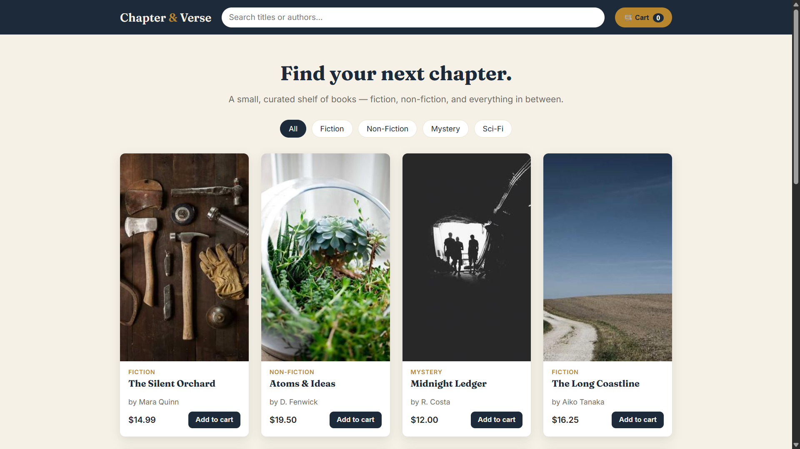
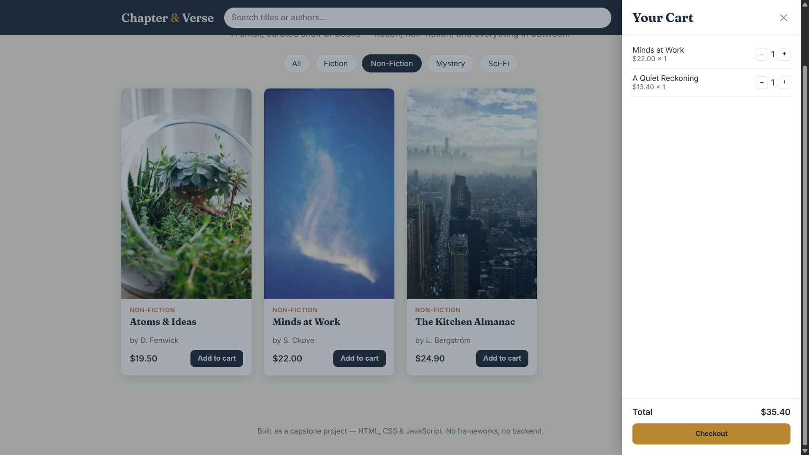

# 📚 Chapter & Verse — Online Book Store

A responsive online bookstore developed as the **Task 5 Capstone Project** during the **ApexPlanet Web Development Internship**.

The application is built using **HTML5**, **CSS3**, and **Vanilla JavaScript**, demonstrating responsive web design, DOM manipulation, dynamic user interactions, and front-end development best practices.

---

## ✨ Features

- 📚 Dynamic Book Catalog
- 🔍 Real-time Search Functionality
- 🏷️ Category-Based Book Filtering
- 🛒 Interactive Shopping Cart
- 💰 Automatic Cart Total Calculation
- 📱 Fully Responsive Design
- ⚡ Fast and Lightweight User Interface
- 🎨 Clean and Modern UI

---

## 🛠️ Technologies Used

- HTML5
- CSS3
- JavaScript (ES6)
- Flexbox
- CSS Grid
- Local Storage

---

## 📂 Project Structure

```text
Chapter & Verse – Book Store  
│
├── screenshots/
│   ├── home.png
│   └── cart.png
│
├── index.html
├── style.css
└── script.js
```

---

## 📸 Screenshots

### 🏠 Home Page



### 🛒 Shopping Cart



---

## ⚡ Performance Optimizations

- Deferred JavaScript loading using the `defer` attribute
- Google Fonts preconnect for faster font loading
- Responsive layout built with Flexbox and CSS Grid
- Efficient DOM manipulation for smooth user interaction
- Optimized project structure for better performance

---

## 🌍 Browser Compatibility

Tested and verified on:

- ✅ Google Chrome
- ✅ Microsoft Edge
- ✅ Mozilla Firefox

Responsive layouts have been tested for:

- 📱 Mobile Devices
- 💻 Tablets
- 🖥️ Desktop Screens

---

## 🚀 How to Run the Project

1. Clone this repository:

```bash
git clone https://github.com/syed7396/Chapter-Verse-Book-Store.git
```

2. Open the project folder.

3. Double-click **index.html** or open it in any modern web browser.

No installation or additional dependencies are required.

---

## 🎯 Internship Task

This project was developed as the **Task 5 Capstone Project** for the **ApexPlanet Web Development Internship**.

It demonstrates:

- Responsive Web Design
- Dynamic User Interface
- JavaScript DOM Manipulation
- Shopping Cart Functionality
- Performance Optimization
- Front-End Development Best Practices

---

## 🔮 Future Improvements

- User Authentication
- Backend Integration
- Online Payment Gateway
- Wishlist Feature
- Product Reviews and Ratings
- Database Integration

---

## 👨‍💻 Author

**Syed Adnan**

GitHub: https://github.com/syed7396

LinkedIn: https://www.linkedin.com/in/syed13/

---
